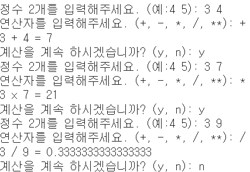
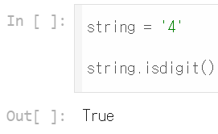

# AIFFEL Campus Online Code Peer Review Templete
- 코더 : 반업석
- 리뷰어 : 최성호


# PRT(Peer Review Template)
- [X]  **1. 주어진 문제를 해결하는 완성된 코드가 제출되었나요?**
    - 계산이 정상적으로 진행되는 것을 확인할 수 있습니다.
    - 
        
 - [X]  **2. 전체 코드에서 가장 핵심적이거나 가장 복잡하고 이해하기 어려운 부분에 작성된 
주석 또는 doc string을 보고 해당 코드가 잘 이해되었나요?**
    - 주석은 상세하게 잘 작성되어 있었습니다.
    - main() 함수를 제외한 코드가 다 핵심적인 기능을 한다고 판단되어, 캡쳐는 따로 하지 않았습니다.
    - 작성된 주석을 보고 코드에 대한 이해가 잘 되었습니다.
        
- [X]  **3. 에러가 난 부분을 디버깅하여 문제를 해결한 기록을 남겼거나
새로운 시도 또는 추가 실험을 수행해봤나요?**
    - 에러는 발생하지 않았습니다.
    - .isdigit() 함수를 테스트하는 부분이 남아있었습니다.
    - 
        
- [ ]  **4. 회고를 잘 작성했나요?**
    - 아쉽게도 회고는 적혀있지 않았습니다.
        
# 회고(참고 링크 및 코드 개선)
```
'try - except - else - finally' 등의 구문을 사용하지 않고 코드를 작성해서 결과를 출력한 점이
인상깊었습니다.
```
