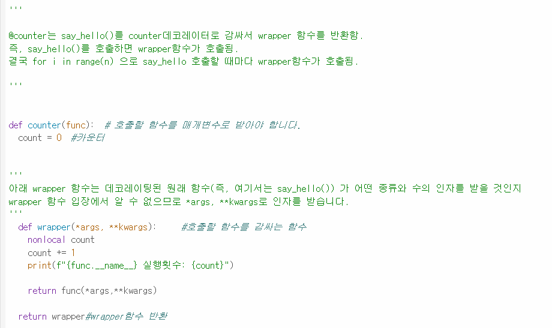

# AIFFEL Campus Online Code Peer Review Templete
- 코더 : 반업석, 김민규(03)
- 리뷰어 : 고은비

# PRT(Peer Review Template)
- [0]  **1. 주어진 문제를 해결하는 완성된 코드가 제출되었나요?**
    - 문제에서 요구하는 최종 결과가 잘 도출되었습니다!
        
        
        
    
- [0]  **2. 전체 코드에서 가장 핵심적이거나 가장 복잡하고 이해하기 어려운 부분에 작성된 
주석 또는 doc string을 보고 해당 코드가 잘 이해되었나요?**
    - 작성한 코드에 대해 주석으로 설명이 잘 적혀있었습니다. 

- [V]  **3. 에러가 난 부분을 디버깅하여 문제를 해결한 기록을 남겼거나
새로운 시도 또는 추가 실험을 수행해봤나요?**
    - 디버깅을 한 흔적은 보이지않는 것 같습니다.
    - 하지만, 답을 도출해가는 과정이 잘 기록되어 있었습니다.

        
- [0]  **4. 회고를 잘 작성했나요?**
    - 오늘 퀘스트를 진행하면서 배운점 및 추후 더 학습이 필요한 부분에 대해 적혀있었고,
      회고가 잘 작성되었습니다.
 
 
 
- [0]  **5. 코드가 간결하고 효율적인가요?**
    - 네!

# 회고

리뷰어(고은비)
1번 문제의 경우, 퍼실님께서 주석으로 코드를 추가해야 할 부분에 대해서 적어주셔서 쉽게 진행하신 것 같다.
2번 문제의 경우, 문제를 해결하며 데코레이터 부분에 대해 이해하시려고 노력한 흔적이 보였습니다.
업석님께서 퀘스트를 진행하면서 배우게 된 부분에 대해 말씀해주셨는데, 저도 공감이 되었습니다! 

